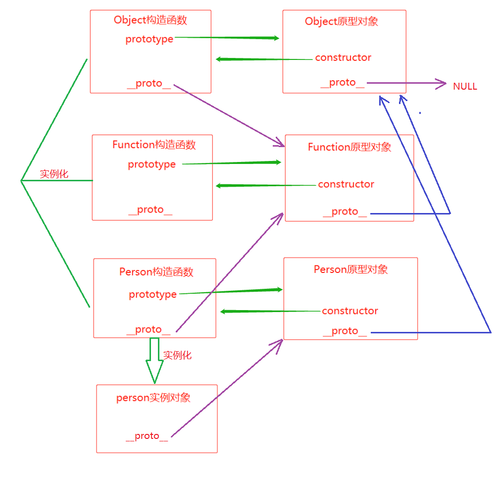

### 1. 创建对象初级方法

#### 1.1 原生JS

```javascript
// 原始
let obj = new Object();
obj.name = 'qq';
obj.say = function(){
    console.log('hello world');
}
// 简写
let obj = {
    name: 'qq',
    say: function(){
        console.log('hello world');
    }
}
```

#### 1.2 工厂函数

```javascript
function createPerson(name, age){
    let obj = {
        obj.name = name,
        obj.age = age,
        obj.say = function(){
            console.log('hello world');
        }
    }
	return obj;
}
let obj1 = craetePerson('qq', 24);
```

---

### 2. 构造函数创建对象

- 首字母必须大写
- 只能通过new来调用

```javascript
function Person(name, age){
    this.name = name;
    this.age = age;
}
Person.prototype = {
    constructor: Person,
    say: function(){
        console.log('hello world');
    }
}
let obj1 = new Person('qq', 24);
```

---

### 3. 对象三角恋关系

#### 3.1 函数 >> prototype

- 每个函数都有**prototype**属性，是一个对象（原型对象）

- 构造函数的prototype特点
  - prototype中的方法和属性，可以被其所有实例对象共享
  - prototype中有属性和方法，其构造函数中也有同名的属性和方法
    - 实例对象在访问的时候, 访问到的是其构造函中的属性和方法

#### 3.2 原型对象 >> constructor

- 每个prototype（原型对象）中都有一个**constructor**属性
  - prototype的constructor属性，指向当前prototype对应的那个"构造函数"
  - <font color=red>构造函数.prototype.constructor === 构造函数</font>

#### 3.3 对象 >> \_\_proto\_\_

- 每个对象都有\_\_proto\_\_属性，包括原型对象
- <font color=red>实例对象.\_\_proto === 构造函数.prototype</font>
- <font color=red>原型对象.\_\_proto === Object.prototype</font>
- <font color=red>Object.prototype.\_\_proto === null</font>

---

### 4. Function函数

- Function函数就是一个构造函数
- 所有函数（包括构造函数Person）都是Function构造函数的实例对象
  - **Person.\_\_proto\_\_ === Function.prototype**
- Function函数也是一个对象
  - **Function.\_\_proto\_\_ === Functio.prototype**

---

### 5. Object函数

- Object是JavaScript中系统提供的一个构造函数
- Object函数也是Function构造函数的实例对象
  - **Object.\_\_proto\_\_ === Function.prototype**
  - **Object.prototype.constructor === Object**
  - <font color=red>Object.prototype.\_\_proto === null</font>

---

### 6. 函数与对象完整关系图

- prototype + constructor + \_\_proto\_\_



### 7. 原型链

- 实例对象查找属性和方法顺序
  - 构造函数 >> 实例对象.\_\_proto\_\_ >> 实例对象.\_\_proto\_\_.\_\_proto\_\_ >> 报错
- 以上图的person实例对象为例
  - person实例对象 >> Person原型对象 >> Object原型对象 >> 报错
- <font color='red'>注意点：实际测试中，不会找Object.prototype中的属性</font>

### 8. 对象三大特性