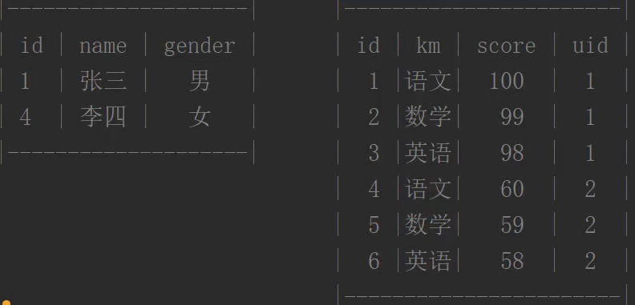
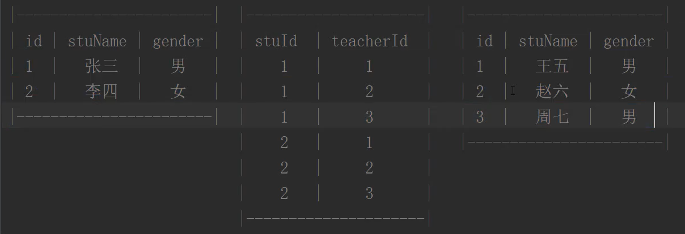

#### 1. MySQL服务器的连接和退出

- 连接：

  - 完整格式：mysql -h主机地址 -P端口号 -u用户名 -p用户密码
  - 常用简写：mysql -h主机地址 -u用户名 -p（密码使用暗文形式）

- 退出

  - ```mysql
    exit;
    ```

  - ```mysql
    quit
    ```

  - ```mysql
    \q
    ```

#### 2. 查看数据库的编码

- 查看数据库全局默认的编码

  - ```mysql
    show variables like 'character_set_%';
    ```

- 查看某个数据库的编码

  - show create database 数据库名;

#### 3. 增删改查

##### 3.1 数据库的增删查改

- 显示数据库

  - 查看指定数据库

    - show create database 数据库名称;

  - 查看所有数据库

    - ```mysql
      show databases;
      ```

  - 默认有4个数据库

    1. information_schema：保存着关于MySQL服务器所维护的所有其他数据库的信息，如数据库名，数据库的表，表栏的数据类型与访问权限等
    2. mysql：MySQL系统数据库，保存了登录用户名，密码，以及每个用户的权限等
    3. performance_schema：用来保存数据库服务器性能的参数
    4. sys：这个库是通过视图的形式把information_schema和performance_schema结合起来，查询出更加令人容易理解的数据

- 创建数据库

  - create database if not exists 数据库名称 charset=utf8;

- 删除数据库

  - drop database if exists 数据库名称;

- 修改数据库

  - 只能修改数据库的字符集
    - alter database 数据库名称 charset=字符集;

##### 3.2 表的增删查改

- 注意点：在对表进行操作的时候，必须指定某一个数据库

  - use 数据库名称;

- 查看表

  - 查看数据库中有哪些表

    - ```mysql
      show tables;
      ```

  - 查看指定表的结构

    - desc 表的名称;

- 创建表

  - ```mysql
    create table if not exists stu(
    	id int, #表的名称 表中数据的数据类型,
    	name text #表的名称 表中数据的数据类型
    )
    ```

- 删除表

  - drop table if exists 表名;

- 修改表

  - 修改表名
    - rename table 旧名称 to 新名称;
  - 添加字段
    - alter table 表名 add 新增字段名称 新增字段数据类型 [位置]
    - 默认新增的字段会放到原有字段的后面
    - alter table stu add age int;
    - 放到最前面：alter table stu add age int first;
    - 放到某个字段后面：alter table stu add age int after name;
  - 删除字段
    - alter table 表名 drop 字段名称;
  - 修改字段
    - 修改字段数据类型
      - alter table 表名 modify 需要修改的字段名称 新的数据类型;
    - 修改字段的名称和数据类型
      - alter table 表名 change 原始字段名称 新的字段名称 新的数据类型;

##### 3.3 数据的增删改查

- 插入数据

  - insert into 表名 (字段名称1, 字段名称2) values (值1, 值2);

  - ```mysql
    insert into stu (id, name) values (1, 'qq');
    ```

  - 注意点：

    1. 插入数据的时候，指定字段名称顺序可以和表中的字段顺序不一样
    2. 插入数据的时候，指定取值的顺序必须和指定字段名称顺序一样
    3. 插入数据的时候，如果指定取值的顺序和表中的字段顺序一样，那么可以不指定字段名称
    4. 可以同时插入多条数据，一条数据一个括号，中间逗号隔开

- 查询数据

  - 查询某个表中所有字段的数据
    - select * from stu;
  - 查询特定字段的数据
    - select 字段名称1 from 表名;
  - 查询某个表中满足条件的数据
    - select 字段名称1, 字段名称2 from 表名 [where 条件];

- 更新数据

  - update 表名 set 字段名称=值 [where 条件];

  - 注意点：

    - 不指定条件时，整个表的数据都会被修改
    - 可以指定多个条件，支持AND OR = != 等 [支持的条件](https://www.runoob.com/mysql/mysql-where-clause.html)

  - ```mysql
    update stu set score = 77 where name = 'qq' AND id = 1;
    ```

- 删除数据
  - delete from 表名 [where 条件];
  - delete from 表名;

#### 4. 表的存储引擎

- MySQL中有三种存储引擎

  1. MyISAM：安全性低，不支持事务和外键，适合频繁插入和查询的应用
  2. InnoDB（默认）：安全性高，支持事务和外键，适合对安全性，数据完整性要求较高的应用
  3. Memory：数据存储到内存中，访问速度极快，但不会永久存储数据，适合对读写速度要求极高的应用

- 创建表的时候指定存储引擎

  - ```mysql
    create table stu(
    	id int,
    	name text
    )engine=引擎名称;
    ```

- 修改表的存储引擎

  - alter table 表名 engine=引擎名称;

#### 5. MySQL数据类型

- MySQL支持多种类型，大致可以分为三类：数值、日期/时间和字符串(字符)类型。
- [菜鸟文档](https://www.runoob.com/mysql/mysql-data-types.html)
- [详细分类视频](https://www.it666.com/course/118/task/7971/show)

#### 6. 数据完整性
##### 6.1 实体完整性

- 一行数据就是一个实体
- 保证实体完整性就是保证每一行数据的唯一性

###### 6.1.1 主键约束

   - 主键用于唯一标识表中的每一条数据，类似于身份证

   - ```mysql
     create table person2(
     	id int primary key,//在字段数据类型后面加primary key,将这个字段变成主键
     	name varchar(20)
     );
     ```

   - 主键的特征

     1. 如果某个字段设置成了主键，那么这个主键的取值就不能重复了

     2. 如果某个字段设置成了主键，那么这个字段就不能是null了

     3. 一张表中只能有一个主键，不能出现多个主键

     4. 另一种格式

        ```
        create table person2(
        	id int,
        	name varchar(20),
        	primary key(id)
        );
        ```

- 联合主键

  - 同时将多个字段组合起来作为一个主键使用

  - ```mysql
    create table person2(
    	id int,
    	name varchar(20),
    	primary key(name, age)
    );
    ```

  - 

###### 6.1.2 唯一约束

- 唯一约束用于保证某个字段的值永远不重复

- ```mysql
  create table person(
  	id int unique,
      name varchar(20)
  );
  ```

- 被约束字段的取值不能重复

- 一张表中，唯一约束的字段可以有多个

- 唯一约束的字段，取值可以为null

###### 6.1.3 自动增长列

- 让某一个字段的取值从1开始递增，保证实体完整性

- ```mysql
  crate table person(
  	id int auto_increment primary key,
      name varchar(20)
  );
  ```

- 注意点

  1. 要设置某个字段为自动增长，那么这个字段必须是主键
  2. 自动增长的主键，取值可以是null 和 default

###### 6.1.4 如何选择

- 最少性：能用一个字段作为主键，就不要使用多个字段
- 稳定性：尽量用不被操作和修改的字段作为主键
- 一般情况：定义一个整型的id 字段，设置成自动增长的主键

###### 6.1.5 如何修改约束

- 添加主键约束

   - ```mysql
     alter table 表名 add primary key(字段);
     ```

- 添加唯一约束

   - ```mysql
     alter table 表名 add unique(字段);
     ```

- 添加自动增长约束

   - ```mysql
      alter table 表名 modify 字段名称 数据类型 auto_increment;
      ```

##### 6.2 域完整性

- 什么是域
  
- 一行数据中的每个单元格都是一个域
  
- 保证域的完整性

  - 保证每个单元格数据的正确性

- 方法

  1. 使用正确的数据类型

  2. 使用非空约束（not null）

     ```mysql
     crate table person(
     	id int,
         name varchar(20) not null
     );
     ```

  3. 使用默认值约束（default）

     ```mysql
     crate table person(
     	id int,
         name varchar(20) default 'qq'
     );
     ```

     

##### 6.3 参照完整性

- 参照完整性又称引用完整性，主要用于保证多表之间引用关系的正确性

###### 6.3.1为什么要创建多张表

  - 所有数据保存到一张表中，会出现冗余数据
  - 为了提升效率，根据需求对表进行拆分
  - 表之间的关系
    1. 一对一（不需要拆分）
    2. 一对多（需要拆分）
       - 
    3. 多对多（需要拆分）
       - 

###### 6.3.2 外键

- 动态添加外键

  - alter table 从表名称 add foreign key(外键字段) references 主表名称(主表主键名称);

  ```mysql
  create table grade(
  	id int auto_increment primary key,
      km varchar(20),
      score double,
      uid int
  );
  alter table grade add foreign key(uid) references stu(id);
  ```

- 查看外键

  - show create table 从表名称;

    ```mysql
    show create table grade;
    ```

  - CONSTRAINT `grade_ibfk_1` FOREIGN KEY (`uid`) REFERENCES `stu` (`id`)

- 动态删除外键

  - alter table 从表名称 drop foreign key 外键名称;

    ```mysql
    alter table grade drop foreign key grade_ibfk_1;
    ```

###### 6.3.3 一对多外键的操作

1. 严格模式

   - 主表不存在对应数据，从表不允许添加
   - 从表引用着数据，主表不允许修改
   - 从表引用着数据，主表不允许删除

2. 置空操作

   - 给从表指定外键的时候，设置为置空

   - ```mysql
     alter table grade add foreign key(uid) references stu(id) on delete set null;
     ```

   - 此时删除主表数据时，对应的从表引用会置空（Null）

3. 级联操作

   - ```mysql
     alter table grade add foreign key(uid) references stu(id) on update cascade;
     ```

   - 此时修改主表数据时，对应的从表引用会自动修改

###### 6.3.4 多对多外键

- ```mysql
  create table stu(
  	id int auto_increment primary key,
      name varchar(20),
      gender enum('男', '女')
  );
  create table teacher(
  	id int auto_increment primary key,
      name varchar(20),
      gender enum('男', '女')
  );
  # 关系表
  create table rel(
  	stuId int,
      teacherId int
  );
  # 添加对应外键
  alter table rel add foreign key(stuId) references stu(id) on update cascade;
  alter table rel add foreign key(teacherId) references teacher(id) on update cascade;
  # 在添加学生和老师表数据后，就可添加对应关系，保持完整性
  ```