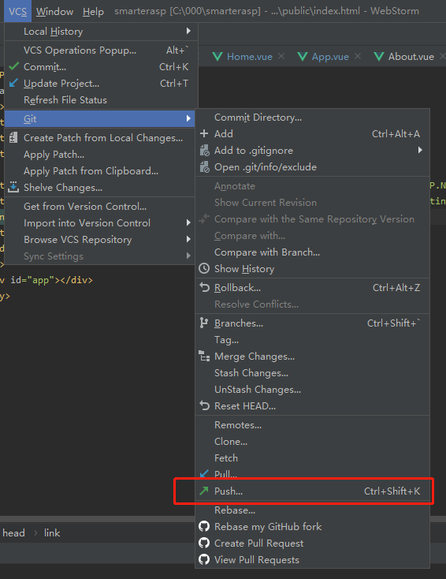

1. Vue-CLI创建默认vue项目

   - 安装Vue-CLI

     ```bash
     npm install -g @vue/cli
     # OR
     yarn global add @vue/cli
     ```

   - 创建项目

     ```bash
     vue create my-project
     # OR
     vue ui
     ```

2. 发布到github仓库

