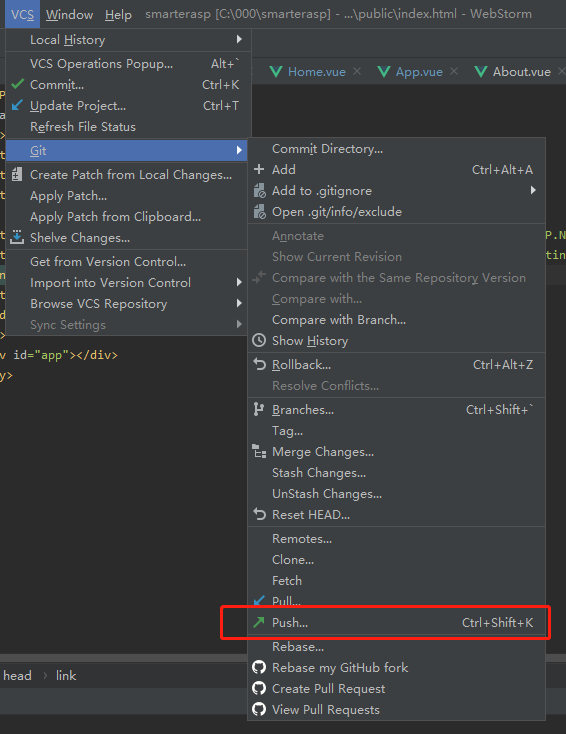

##### 1. Vue-CLI创建默认vue项目

   - 安装Vue-CLI

     ```bash
     npm install -g @vue/cli
     # OR
     yarn global add @vue/cli
     ```

   - 创建项目

     ```bash
     vue create my-project
     # OR
     vue ui
     ```
     
     - node-sass是自动编译实时的，dart-sass需要保存后才会生效
     - sass 官方目前主力推dart-sass 最新的特性都会在这个上面先实现

##### 2. 发布到github仓库



##### 3. 请求网络数据

- 安装axios

  ```bash
  npm install axios
  ```

- src目录下新建api文件夹，新建network.js对axios进行配置